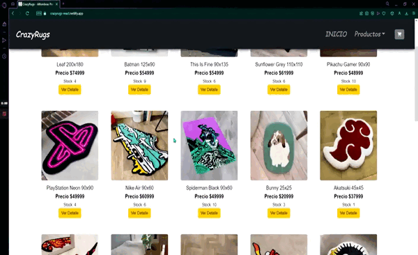

# CrazyRugs - Tienda de Alfombras Personalizadas

_Este proyecto es un E-commerce creado con React para el curso de React de CoderHouse. [Link a sitio web](https://crazyrugs-react.netlify.app)_

## Recorrido del sitio

## Instalación

Para clonar este repositorio:

`git clone https://github.com/nkyozkz/CrazyRugsReact`

Instalacion de dependecias:

`npm install`

luego de instalar las dependencias necesarias para que el proyecto funcione, puedes ejecutarlo de manera local con el comando:

`npm start`

## Dependencias Utilizadas

*[Boostrap](https://react-bootstrap.github.io/getting-started/introduction)

*[React Router](https://v5.reactrouter.com/web/guides/quick-start)

*[Sweetalert2](https://sweetalert2.github.io/#download)

*[Fontawesome](https://fontawesome.com/v5/docs/web/use-with/react)

*[Firebase](https://www.google.com/aclk?sa=l&ai=DChcSEwjjt5PyqY78AhUcQEgAHdalAEoYABAAGgJjZQ&sig=AOD64_3KYj2rb3PUy_p0hIWd6OqLzWZ19w&q&adurl&ved=2ahUKEwjFjo7yqY78AhUfD7kGHc7lD20Q0Qx6BAgHEAE)

## Funcionamiento del proyecto

Este proyecto simula una tienda online, el usuario puede elegir productos en 3 categorías de tamaños **Large**, **Medium** y **small**, cuando el usuario esté listo para agregar el producto tiene que presionar ver detalle, lo que lo envía a la pestaña del producto, donde se puede agregar la cantidad deseada al carrito teniendo en cuenta el stock que maneja Firebase, cuando el carrito del usuario esté listo deberá presionar **Finalizar Compra** en la página del ítem o en el carrito, aparecerá un formulario donde el usuario llenara sus datos, esto crea un ticket que envía la información introducida a la base de datos y le **devuelve el número de pedido al usuario** junto con los datos que este introdujo para confirmar que su pedido se realizo.
